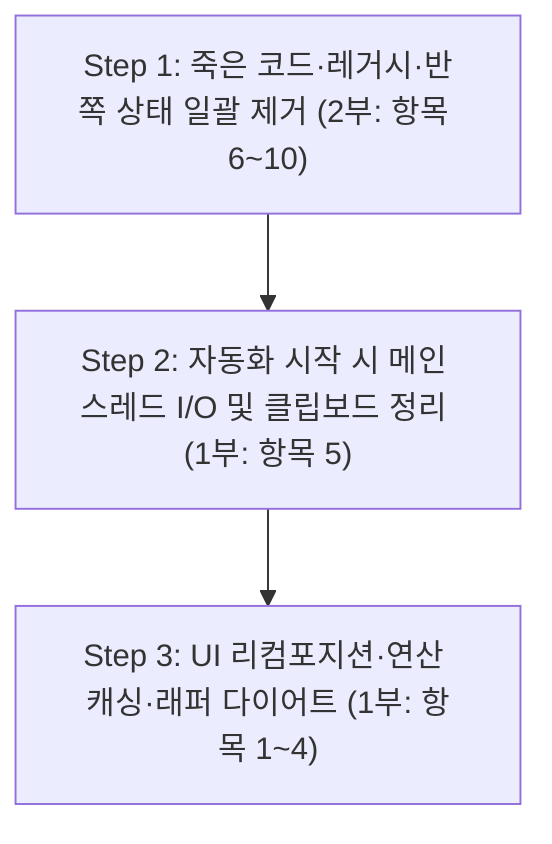

# 앱 경쾌화를 위한 UI·실행 곁다리 및 죽은 코드 정리 체크리스트

이 문서는 앱 조작·타이핑·탭 전환 및 자동화 시작 순간에 **반응 속도를 떨어뜨리는 불필요한 UI/I/O 곁다리**와, 기능이 바뀌면서 **실제로는 쓰이지 않는데 남아 있는 죽은 코드·레거시 잔재**를 한눈에 파악하고 안전하게 걷어낼 수 있도록 정리한 체크리스트입니다.

> 💡 **규칙**: 해결 완료된 항목은 체크박스를 체크(`- [x]`)하고, 항목명 및 본문 내용에 취소선(`~~...~~`)을 긋습니다.

---

## 📋 전체 요약 체크리스트

| 체크 | 구분 | 항목명 | 관련 위치/모듈 | 심각도 / 작업 성격 |
| :---: | :---: | :--- | :--- | :---: |
| - [ ] | **UI 리컴포지션** | [1. 3개 탭 상태 결합(`remember`)으로 인한 숨겨진 탭 강제 다시 그리기 해소](#1-3개-탭-상태-결합remember으로-인한-숨겨진-탭-강제-다시-그리기-해소) | [`AutomationApp.kt`](file:///c:/Users/joajo/AndroidStudioProjects/gemgemgen/app/src/main/java/com/example/gemgemgen/ui/AutomationApp.kt) [`MainTabbedScreen.kt`](file:///c:/Users/joajo/AndroidStudioProjects/gemgemgen/app/src/main/java/com/example/gemgemgen/ui/MainTabbedScreen.kt) | ⚡ 높음 (타이핑·진행 중 전 탭 재계산 차단) |
| - [ ] | **UI 연산 낭비** | [2. 와일드카드 편집 화면의 매 프레임 전체 줄 재분할(`get()`) 캐싱](#2-와일드카드-편집-화면의-매-프레임-전체-줄-재분할get-캐싱) | [`WildcardUiModels.kt`](file:///c:/Users/joajo/AndroidStudioProjects/gemgemgen/app/src/main/java/com/example/gemgemgen/wildcard/ui/WildcardUiModels.kt) | ⚡ 중간 (편집 화면 스크롤·선택 경쾌화) |
| - [ ] | **테마 중복** | [3. `GemgemgenTheme` 이중 감싸기 및 테마 상태 중복 구독 제거](#3-gemgemgentheme-이중-감싸기-및-테마-상태-중복-구독-제거) | [`MainActivity.kt`](file:///c:/Users/joajo/AndroidStudioProjects/gemgemgen/app/src/main/java/com/example/gemgemgen/ui/MainActivity.kt) [`AndroidAutomationHost.kt`](file:///c:/Users/joajo/AndroidStudioProjects/gemgemgen/app/src/main/java/com/example/gemgemgen/ui/android/AndroidAutomationHost.kt) [`AutomationViewModel.kt`](file:///c:/Users/joajo/AndroidStudioProjects/gemgemgen/app/src/main/java/com/example/gemgemgen/automation/ui/AutomationViewModel.kt) | 🧹 중간 (중복 코루틴·테마 트리 단순화) |
| - [ ] | **래퍼 다이어트** | [4. 136개 버튼 동작을 3중으로 재포장하는 `*AppActions` 징검다리 클래스 제거](#4-136개-버튼-동작을-3중으로-재포장하는-appactions-징검다리-클래스-제거) | [`AutomationApp.kt`](file:///c:/Users/joajo/AndroidStudioProjects/gemgemgen/app/src/main/java/com/example/gemgemgen/ui/AutomationApp.kt) [`AndroidAutomationHost.kt`](file:///c:/Users/joajo/AndroidStudioProjects/gemgemgen/app/src/main/java/com/example/gemgemgen/ui/android/AndroidAutomationHost.kt) | ✂️ 높음 (~450줄 보일러플레이트 및 클로저 제거) |
| - [ ] | **메인 스레드 I/O** | [5. 자동화 시작 시 화면 스레드 동기 이력 JSON 파싱 및 매번 클립보드 덮어쓰기 정리](#5-자동화-시작-시-화면-스레드-동기-이력-json-파싱-및-매번-클립보드-덮어쓰기-정리) | [`AutomationViewModel.kt`](file:///c:/Users/joajo/AndroidStudioProjects/gemgemgen/app/src/main/java/com/example/gemgemgen/automation/ui/AutomationViewModel.kt) [`RecordAutomationHistoryUseCase.kt`](file:///c:/Users/joajo/AndroidStudioProjects/gemgemgen/app/src/main/java/com/example/gemgemgen/automation/usecase/RecordAutomationHistoryUseCase.kt) [`PromptHistoryStore.kt`](file:///c:/Users/joajo/AndroidStudioProjects/gemgemgen/app/src/main/java/com/example/gemgemgen/automation/usecase/PromptHistoryStore.kt) | 🚨 높음 (시작 버튼 클릭 즉시성 확보) |
| - [x] | **죽은 파일 삭제** | ~~[6. 구버전 다중 계정 관리 잔재(파일 4개) 삭제 및 원격 빈 문자열 파라미터 정리](#6-구버전-다중-계정-관리-잔재파일-4개-삭제-및-원격-빈-문자열-파라미터-정리)~~ | [`GeminiAccountProfile.kt`](file:///c:/Users/joajo/AndroidStudioProjects/gemgemgen/app/src/main/java/com/example/gemgemgen/automation/domain/GeminiAccountProfile.kt) 외 3개 파일 [`OpenGeminiAccountPickerUseCase.kt`](file:///c:/Users/joajo/AndroidStudioProjects/gemgemgen/app/src/main/java/com/example/gemgemgen/automation/usecase/OpenGeminiAccountPickerUseCase.kt) | ✂️ 파일 4개 삭제 (~210줄) |
| - [x] | **죽은 경로 삭제** | ~~[7. 구버전 와일드카드 추천 바(`WildcardTokenSuggestionBar`) 및 문자열 적용 경로 제거](#7-구버전-와일드카드-추천-바wildcardtokensuggestionbar-및-문자열-적용-경로-제거)~~ | [`PromptEditorSection.kt`](file:///c:/Users/joajo/AndroidStudioProjects/gemgemgen/app/src/main/java/com/example/gemgemgen/automation/ui/PromptEditorSection.kt) [`PromptEditorCoordinator.kt`](file:///c:/Users/joajo/AndroidStudioProjects/gemgemgen/app/src/main/java/com/example/gemgemgen/automation/ui/PromptEditorCoordinator.kt) [`ApplyWildcardTokenUseCase.kt`](file:///c:/Users/joajo/AndroidStudioProjects/gemgemgen/app/src/main/java/com/example/gemgemgen/automation/usecase/ApplyWildcardTokenUseCase.kt) | ✂️ 전 계층 죽은 액션 체인 제거 |
| - [x] | **죽은 파일·UI** | ~~[8. 미사용 유스케이스·유틸 파일(2개) 및 구형 단독 다이얼로그 래퍼(2개) 삭제](#8-미사용-유스케이스유틸-파일2개-및-구형-단독-다이얼로그-래퍼2개-삭제)~~ | [`ResolveWildcardAutocompleteUseCase.kt`](file:///c:/Users/joajo/AndroidStudioProjects/gemgemgen/app/src/main/java/com/example/gemgemgen/automation/usecase/ResolveWildcardAutocompleteUseCase.kt) [`TraceUtils.kt`](file:///c:/Users/joajo/AndroidStudioProjects/gemgemgen/app/src/main/java/com/example/gemgemgen/core/TraceUtils.kt) [`StatusSettingsDialog.kt`](file:///c:/Users/joajo/AndroidStudioProjects/gemgemgen/app/src/main/java/com/example/gemgemgen/automation/ui/StatusSettingsDialog.kt) | ✂️ 파일 2개 삭제 + 미사용 UI 정리 |
| - [x] | **반쪽짜리 상태** | ~~[9. 읽지 않거나 값을 넣지 않는 반쪽짜리 `UiState` 필드 및 중복 `StateFlow` 제거](#9-읽지-않거나-값을-넣지-않는-반쪽짜리-uistate-필드-및-중복-stateflow-제거)~~ | [`AutomationUiState.kt`](file:///c:/Users/joajo/AndroidStudioProjects/gemgemgen/app/src/main/java/com/example/gemgemgen/automation/ui/AutomationUiState.kt) [`WildcardClassifyCoordinator.kt`](file:///c:/Users/joajo/AndroidStudioProjects/gemgemgen/app/src/main/java/com/example/gemgemgen/wildcard/ui/WildcardClassifyCoordinator.kt) | 🧹 불필요한 리스트 복사·상태 제거 |
| - [x] | **레거시 호환** | ~~[10. 호출처가 사라진 미사용 하위 호환 파라미터·오버로드·정책 메서드 정리](#10-호출처가-사라진-미사용-하위-호환-파라미터오버로드정책-메서드-정리)~~ | [`PrepareAutomationRunUseCase.kt`](file:///c:/Users/joajo/AndroidStudioProjects/gemgemgen/app/src/main/java/com/example/gemgemgen/automation/usecase/PrepareAutomationRunUseCase.kt) [`CoordinateAutomationExecutionUseCase.kt`](file:///c:/Users/joajo/AndroidStudioProjects/gemgemgen/app/src/main/java/com/example/gemgemgen/automation/usecase/CoordinateAutomationExecutionUseCase.kt) [`AutomationExecutionPolicy.kt`](file:///c:/Users/joajo/AndroidStudioProjects/gemgemgen/app/src/main/java/com/example/gemgemgen/automation/domain/AutomationExecutionPolicy.kt) [`AnalysisStartPolicy.kt`](file:///c:/Users/joajo/AndroidStudioProjects/gemgemgen/app/src/main/java/com/example/gemgemgen/analysis/domain/AnalysisStartPolicy.kt) | ✂️ 미사용 정책/호환 코드 정리 |

---

## 1부. ⚡ 화면 조작·타이핑·자동화 시작 시 반응 속도를 떨어뜨리는 곁다리 (성능·체감 속도 개선)

### 1. 3개 탭 상태 결합(`remember`)으로 인한 숨겨진 탭 강제 다시 그리기 해소
- **관련 파일**:
  - 3탭 조립 화면: [`AutomationApp.kt`](file:///c:/Users/joajo/AndroidStudioProjects/gemgemgen/app/src/main/java/com/example/gemgemgen/ui/AutomationApp.kt#L323-L359)
  - 탭 전환 컨테이너: [`MainTabbedScreen.kt`](file:///c:/Users/joajo/AndroidStudioProjects/gemgemgen/app/src/main/java/com/example/gemgemgen/ui/MainTabbedScreen.kt#L105-L108), [`MainTabbedScreen.kt` 탭 본문 렌더링](file:///c:/Users/joajo/AndroidStudioProjects/gemgemgen/app/src/main/java/com/example/gemgemgen/ui/MainTabbedScreen.kt#L231-L250)
- **어떤 문제인가요?**:
  - [`MainTabbedScreen.kt`](file:///c:/Users/joajo/AndroidStudioProjects/gemgemgen/app/src/main/java/com/example/gemgemgen/ui/MainTabbedScreen.kt#L231-L250)는 탭 전환 시 깜빡임을 막기 위해 한 번 방문한 모든 탭을 화면 뒤에 투명하게(`alpha = 0f`) 상주시켜 둡니다.
  - 그런데 [`AutomationApp.kt`](file:///c:/Users/joajo/AndroidStudioProjects/gemgemgen/app/src/main/java/com/example/gemgemgen/ui/AutomationApp.kt#L323-L359)에서 `val tabs = remember(mainUiState, automationBarUiState, promptTemplateState, analysisUiState, analysisPromptState, wildcardUiState, ...)`처럼 **3개 탭의 모든 상태를 하나의 `remember` 열쇠로 묶어** `List<MainTabPage>`와 각 탭의 `content` 람다를 매번 새로 만들고 있습니다.
- **실제 영향**:
  - 자동화 탭에서 프롬프트를 한 글자 입력하거나 자동화 대기 타이머가 1초씩 바뀔 때마다, **화면에 보이지도 않는 분석 탭(`AnalysisScreen`)과 와일드카드 탭(`WildcardScreen`)의 UI 함수까지 매번 강제로 다시 실행(Recomposition)**되어 타이핑과 화면 반응이 무거워집니다.
- **개선 방안**:
  - 각 탭의 `MainTabPage`(또는 탭별 컴포저블 래퍼)가 **자기 탭에 해당하는 상태만 읽도록 분리**하여, 자동화 탭의 상태가 변할 때 분석 탭·와일드카드 탭은 리컴포지션을 건너뛰게(Skip) 만듭니다.

---

### 2. 와일드카드 편집 화면의 매 프레임 전체 줄 재분할(`get()`) 캐싱
- **관련 파일**:
  - 와일드카드 UI 모델: [`WildcardUiModels.kt`](file:///c:/Users/joajo/AndroidStudioProjects/gemgemgen/app/src/main/java/com/example/gemgemgen/wildcard/ui/WildcardUiModels.kt#L58-L79)
- **어떤 문제인가요?**:
  - `WildcardUiState` 내부의 `selectableLines`(`get() = WildcardDynamicPromptComposer.selectableLines(editingText)`)와 `fileItems`(`get() = files.map { ... }`)가 값을 보관하지 않고 **읽을 때마다 매번 계산하는 프로퍼티(`get()`)**로 선언되어 있습니다.
  - `selectableLines`는 `canRequestClassify`(59행), `canSelectAllLines`(61행), 그리고 [`WildcardScreen.kt`](file:///c:/Users/joajo/AndroidStudioProjects/gemgemgen/app/src/main/java/com/example/gemgemgen/wildcard/ui/WildcardScreen.kt)의 줄 목록 렌더링 과정에서 **한 화면을 그리는 동안에도 여러 번 반복 호출**됩니다.
- **실제 영향**:
  - 와일드카드 파일이 길수록 화면이 조금만 갱신되어도 전체 텍스트를 줄 단위로 쪼개고(`lines()`), 공백을 다듬고(`trim()`), 새 리스트를 만드는 작업이 매 프레임 수차례 반복되어 스크롤·줄 선택 반응성을 떨어뜨립니다.
- **개선 방안**:
  - `selectableLines`와 `fileItems`를 `get()` 대신 `WildcardUiState` 인스턴스 생성 시 1회만 계산되어 저장되는 일반 프로퍼티(또는 `editingText`/`files` 변경 시에만 갱신되는 필드)로 변경합니다.

---

### 3. `GemgemgenTheme` 이중 감싸기 및 테마 상태 중복 구독 제거
- **관련 파일**:
  - 액티비티 진입점: [`MainActivity.kt`](file:///c:/Users/joajo/AndroidStudioProjects/gemgemgen/app/src/main/java/com/example/gemgemgen/ui/MainActivity.kt#L23-L28)
  - 앱 호스트: [`AndroidAutomationHost.kt`](file:///c:/Users/joajo/AndroidStudioProjects/gemgemgen/app/src/main/java/com/example/gemgemgen/ui/android/AndroidAutomationHost.kt#L236-L240)
  - 뷰모델 테마 구독: [`AutomationViewModel.kt`](file:///c:/Users/joajo/AndroidStudioProjects/gemgemgen/app/src/main/java/com/example/gemgemgen/automation/ui/AutomationViewModel.kt#L167-L178)
  - 플로팅 오버레이 바: [`FloatingOverlayBar.kt`](file:///c:/Users/joajo/AndroidStudioProjects/gemgemgen/app/src/main/java/com/example/gemgemgen/automation/ui/FloatingOverlayBar.kt#L56)
- **어떤 문제인가요?**:
  - [`MainActivity.kt`](file:///c:/Users/joajo/AndroidStudioProjects/gemgemgen/app/src/main/java/com/example/gemgemgen/ui/MainActivity.kt#L23-L28)에서 이미 `themePaletteStore`를 구독해 최상위 `GemgemgenTheme`을 적용하고 있는데, 바로 하위인 [`AndroidAutomationHost.kt`](file:///c:/Users/joajo/AndroidStudioProjects/gemgemgen/app/src/main/java/com/example/gemgemgen/ui/android/AndroidAutomationHost.kt#L236-L240)에서 **두 번째 `GemgemgenTheme`을 중복으로 감싸고** 있습니다.
  - 이를 위해 `AutomationViewModel.init`에서도 코루틴 2개를 별도로 띄워 `themePaletteStore`의 값을 `AutomationUiState`로 중복 복사하고 있습니다.
- **실제 영향**:
  - 불필요한 `CompositionLocalProvider` 트리 중첩과 중복 상태 구독 코루틴이 상시 유지됩니다.
- **개선 방안**:
  - `AndroidAutomationHost`의 중복 `GemgemgenTheme` 래핑을 제거하고, 설정 다이얼로그 표시용 테마 상태만 간결하게 유지합니다. (필요 시 `FloatingOverlayBar`에도 현재 선택된 테마가 일관되게 반영되도록 정리합니다.)

---

### 4. 136개 버튼 동작을 3중으로 재포장하는 `*AppActions` 징검다리 클래스 제거
- **관련 파일**:
  - 중간 래퍼 클래스 정의 및 재포장: [`AutomationApp.kt`](file:///c:/Users/joajo/AndroidStudioProjects/gemgemgen/app/src/main/java/com/example/gemgemgen/ui/AutomationApp.kt#L30-L308)
  - 뷰모델 메서드 바인딩: [`AndroidAutomationHost.kt`](file:///c:/Users/joajo/AndroidStudioProjects/gemgemgen/app/src/main/java/com/example/gemgemgen/ui/android/AndroidAutomationHost.kt#L280-L459)
  - 각 탭 액션 인터페이스: [`AutomationScreenActions.kt`](file:///c:/Users/joajo/AndroidStudioProjects/gemgemgen/app/src/main/java/com/example/gemgemgen/automation/ui/AutomationScreenActions.kt), [`WildcardScreenActions.kt`](file:///c:/Users/joajo/AndroidStudioProjects/gemgemgen/app/src/main/java/com/example/gemgemgen/wildcard/ui/WildcardScreenActions.kt), [`AnalysisScreenActions.kt`](file:///c:/Users/joajo/AndroidStudioProjects/gemgemgen/app/src/main/java/com/example/gemgemgen/analysis/ui/AnalysisScreenActions.kt)
- **어떤 문제인가요?**:
  - [`AutomationViewModel`](file:///c:/Users/joajo/AndroidStudioProjects/gemgemgen/app/src/main/java/com/example/gemgemgen/automation/ui/AutomationViewModel.kt#L140), [`WildcardViewModel`](file:///c:/Users/joajo/AndroidStudioProjects/gemgemgen/app/src/main/java/com/example/gemgemgen/wildcard/ui/WildcardViewModel.kt#L42), [`AnalysisViewModel`](file:///c:/Users/joajo/AndroidStudioProjects/gemgemgen/app/src/main/java/com/example/gemgemgen/analysis/ui/AnalysisViewModel.kt#L71)은 이미 각 화면이 요구하는 `*ScreenActions` 인터페이스를 **직접 구현**하고 있습니다.
  - 그럼에도 중간에 `AutomationAppActions`(56개 람다), `WildcardAppActions`(41개 람다), `AnalysisAppActions`(39개 람다)라는 똑같은 모양의 데이터 클래스를 또 만들고, `AndroidAutomationHost`와 `AutomationApp`에서 **총 136개의 함수를 3중으로 옮겨 담는 코드(~450줄)**가 존재합니다.
- **실제 영향**:
  - 기능적인 역할 없이 136개의 함수 참조 객체(클로저)를 생성·전달하며, 버튼 동작 하나를 수정할 때마다 4~5개 파일을 동시에 고쳐야 하는 가장 큰 구조적 군더더기입니다.
- **개선 방안**:
  - 중간 징검다리인 `AutomationAppActions`·`WildcardAppActions`·`AnalysisAppActions` 및 `remember*ScreenActions` 변환 함수를 제거하고, `AutomationApp`이 `AutomationScreenActions`·`WildcardScreenActions`·`AnalysisScreenActions` 인터페이스를 직접 전달받도록 단순화합니다.

---

### 5. 자동화 시작 시 화면 스레드 동기 이력 JSON 파싱 및 매번 클립보드 덮어쓰기 정리
- **관련 파일**:
  - 자동화 시작 진입점: [`AutomationViewModel.kt`](file:///c:/Users/joajo/AndroidStudioProjects/gemgemgen/app/src/main/java/com/example/gemgemgen/automation/ui/AutomationViewModel.kt#L774-L815)
  - 이력 및 클립보드 기록 유스케이스: [`RecordAutomationHistoryUseCase.kt`](file:///c:/Users/joajo/AndroidStudioProjects/gemgemgen/app/src/main/java/com/example/gemgemgen/automation/usecase/RecordAutomationHistoryUseCase.kt#L24-L36)
  - 이력 저장소 래퍼: [`PromptHistoryStore.kt`](file:///c:/Users/joajo/AndroidStudioProjects/gemgemgen/app/src/main/java/com/example/gemgemgen/automation/usecase/PromptHistoryStore.kt#L29-L51)
  - SharedPreferences JSON 파서: [`SharedPreferencesPromptHistoryRepository.kt`](file:///c:/Users/joajo/AndroidStudioProjects/gemgemgen/app/src/main/java/com/example/gemgemgen/automation/android/SharedPreferencesPromptHistoryRepository.kt#L18-L36)
- **어떤 문제인가요?**:
  - 사용자가 '시작' 버튼을 누르면 [`AutomationViewModel.runAutomation()`](file:///c:/Users/joajo/AndroidStudioProjects/gemgemgen/app/src/main/java/com/example/gemgemgen/automation/ui/AutomationViewModel.kt#L787-L788)이 백그라운드 코루틴으로 들어가기 전에 **화면(메인 UI) 스레드에서 직접 `promptHistoryStore?.load()`를 호출**해 SharedPreferences의 이력 JSON 전체를 동기 파싱합니다.
  - 게다가 이때 `promptEditor.onAutomationStarted(...)`에 전달되는 이력은 **방금 실행한 새 프롬프트가 추가되기 전의 옛날 이력**이며, 정작 코루틴 안쪽의 [`RecordAutomationHistoryUseCase.record()`](file:///c:/Users/joajo/AndroidStudioProjects/gemgemgen/app/src/main/java/com/example/gemgemgen/automation/usecase/RecordAutomationHistoryUseCase.kt#L24-L36)에서 똑같은 JSON을 **한 번 더 파싱하고 전체 재직렬화하여 저장**합니다.
  - 또한 `RecordAutomationHistoryUseCase.record()` 마지막 줄(35행)에서 **매 실행마다 무조건 시스템 클립보드에 프롬프트 전체를 강제로 덮어씁니다(`clipboardGateway.writeText(prompt)`)**. (접근성 입력 시에는 `ACTION_SET_TEXT`를 직접 쓰고 있어 클립보드 붙여넣기를 쓰지 않는데도 매번 사용자 클립보드를 덮어쓰고 시스템 클립보드 토스트/IPC를 유발합니다.)
- **실제 영향**:
  - 시작 버튼을 누르는 순간 메인 스레드에서 JSON 파싱이 돌아 버튼 반응이 미세하게 멈칫하고, 동일 이력 JSON을 2번 연속 읽으며, 사용자의 개인 클립보드 내용이 자동화 시작 때마다 강제로 지워집니다.
- **개선 방안**:
  - `PromptHistoryStore`에 인메모리 캐시를 두거나 이력 로드·갱신을 단일 흐름으로 합쳐 **메인 스레드 중복 JSON 파싱을 제거**하고 최신 이력이 `promptEditor`에 즉시 반영되게 합니다.
  - `RecordAutomationHistoryUseCase`에서 매번 수행하던 불필요한 클립보드 강제 복사(`clipboardGateway.writeText`)를 제거합니다.

---

## 2부. ✂️ 이미 대체되었거나 전혀 쓰이지 않는 죽은 코드·레거시 곁다리 (코드 다이어트)

### ~~6. 구버전 다중 계정 관리 잔재(파일 4개) 삭제 및 원격 빈 문자열 파라미터 정리~~ (완료)
- **관련 파일**:
  - **삭제 대상 미사용 파일 4개**:
    1. [`GeminiAccountProfile.kt`](file:///c:/Users/joajo/AndroidStudioProjects/gemgemgen/app/src/main/java/com/example/gemgemgen/automation/domain/GeminiAccountProfile.kt) (1~11줄, 프로덕션 참조 0건)
    2. [`GeminiAccountRepository.kt`](file:///c:/Users/joajo/AndroidStudioProjects/gemgemgen/app/src/main/java/com/example/gemgemgen/automation/usecase/GeminiAccountRepository.kt) (1~10줄, 프로덕션 참조 0건)
    3. [`SharedPreferencesGeminiAccountRepository.kt`](file:///c:/Users/joajo/AndroidStudioProjects/gemgemgen/app/src/main/java/com/example/gemgemgen/automation/android/SharedPreferencesGeminiAccountRepository.kt) (1~65줄, 프로덕션 참조 0건)
    4. [`ManageGeminiAccountsUseCase.kt`](file:///c:/Users/joajo/AndroidStudioProjects/gemgemgen/app/src/main/java/com/example/gemgemgen/automation/usecase/ManageGeminiAccountsUseCase.kt) (1~123줄, 프로덕션 참조 0건)
  - **빈 문자열 전달 경로 정리 대상**:
    - [`OpenGeminiAccountPickerUseCase.kt`](file:///c:/Users/joajo/AndroidStudioProjects/gemgemgen/app/src/main/java/com/example/gemgemgen/automation/usecase/OpenGeminiAccountPickerUseCase.kt#L24) (`switchGeminiAccount("", "", "")`)
    - [`ManageRemoteAutomationUseCase.kt`](file:///c:/Users/joajo/AndroidStudioProjects/gemgemgen/remote/usecase/ManageRemoteAutomationUseCase.kt#L121-L123)
    - [`RemoteAutomationGateway.kt`](file:///c:/Users/joajo/AndroidStudioProjects/gemgemgen/app/src/main/java/com/example/gemgemgen/remote/usecase/RemoteAutomationGateway.kt#L24), [`AndroidRemoteAutomationGateway.kt`](file:///c:/Users/joajo/AndroidStudioProjects/gemgemgen/app/src/main/java/com/example/gemgemgen/remote/android/AndroidRemoteAutomationGateway.kt#L344-L367)
    - [`RemoteAutomationProtocol.kt`](file:///c:/Users/joajo/AndroidStudioProjects/gemgemgen/app/src/main/java/com/example/gemgemgen/remote/android/RemoteAutomationProtocol.kt#L59-L70), [`RemoteAutomationReceiverService.kt`](file:///c:/Users/joajo/AndroidStudioProjects/gemgemgen/app/src/main/java/com/example/gemgemgen/remote/android/RemoteAutomationReceiverService.kt#L420-L520)
- **내용**:
  - ~~과거 앱 안에서 계정 목록(별칭/이메일)을 저장·관리하던 기능은 제거되고, 현재는 단순히 Gemini 앱의 계정 선택 창만 열어주는 방식(`openGeminiAccountPicker`)으로 바뀌었습니다.~~
  - ~~그러나 예전 도메인·유스케이스·저장소 파일 4개와 관련 단위 테스트가 그대로 남아 있고, 원격 제어 호출 시에도 쓰이지 않는 빈 문자열 3개(`"", "", ""`)를 계속 직렬화해 보내고 있습니다.~~
- **줄일 수 있는 효과**:
  - ~~프로덕션 파일 4개(~210줄) 및 관련 죽은 테스트를 완전히 삭제하고, 원격 계정 창 열기 인터페이스를 파라미터 없는 깔끔한 호출로 단순화할 수 있습니다.~~

---

### ~~7. 구버전 와일드카드 추천 바(`WildcardTokenSuggestionBar`) 및 문자열 적용 경로 제거~~ (완료)
- **관련 파일**:
  - 미사용 UI 컴포저블: [`PromptEditorSection.kt`](file:///c:/Users/joajo/AndroidStudioProjects/gemgemgen/app/src/main/java/com/example/gemgemgen/automation/ui/PromptEditorSection.kt#L748-L767) (`WildcardTokenSuggestionBar`)
  - 미사용 액션 연결: [`AutomationApp.kt`](file:///c:/Users/joajo/AndroidStudioProjects/gemgemgen/app/src/main/java/com/example/gemgemgen/ui/AutomationApp.kt#L47), [`AndroidAutomationHost.kt`](file:///c:/Users/joajo/AndroidStudioProjects/gemgemgen/app/src/main/java/com/example/gemgemgen/ui/android/AndroidAutomationHost.kt#L310), [`AutomationScreenActions.kt`](file:///c:/Users/joajo/AndroidStudioProjects/gemgemgen/app/src/main/java/com/example/gemgemgen/automation/ui/AutomationScreenActions.kt#L29)
  - 뷰모델·코디네이터·유스케이스 중복 메서드: [`AutomationViewModel.kt`](file:///c:/Users/joajo/AndroidStudioProjects/gemgemgen/app/src/main/java/com/example/gemgemgen/automation/ui/AutomationViewModel.kt#L510-L516), [`PromptEditorCoordinator.kt`](file:///c:/Users/joajo/AndroidStudioProjects/gemgemgen/app/src/main/java/com/example/gemgemgen/automation/ui/PromptEditorCoordinator.kt#L489-L540), [`ApplyWildcardTokenUseCase.kt`](file:///c:/Users/joajo/AndroidStudioProjects/gemgemgen/app/src/main/java/com/example/gemgemgen/automation/usecase/ApplyWildcardTokenUseCase.kt#L56-L109)
- **내용**:
  - ~~와일드카드·스니펫 통합 추천 바인 `PromptSuggestionBar`와 `applySuggestion(Candidate)`가 도입되면서 구버전 `WildcardTokenSuggestionBar`는 화면에서 완전히 빠졌습니다.~~
  - ~~하지만 문자열(`token: String`)을 받아 적용하는 옛날 경로가 UI → ViewModel → Coordinator → UseCase 전 계층에 그대로 남아 있으며, 특히 [`ApplyWildcardTokenUseCase.kt`](file:///c:/Users/joajo/AndroidStudioProjects/gemgemgen/app/src/main/java/com/example/gemgemgen/automation/usecase/ApplyWildcardTokenUseCase.kt#L89-L108)의 분기는 논리적으로 절대 도달할 수 없는 죽은 코드입니다.~~
- **줄일 수 있는 효과**:
  - ~~UI부터 UseCase까지 이어진 중복 자동완성 경로 약 130줄을 깔끔하게 걷어내어 자동완성 로직을 단일 경로(`Candidate` 기반)로 일원화합니다.~~

---

### ~~8. 미사용 유스케이스·유틸 파일(2개) 및 구형 단독 다이얼로그 래퍼(2개) 삭제~~ (완료)
- **관련 파일**:
  - **삭제 대상 파일 2개**:
    1. [`ResolveWildcardAutocompleteUseCase.kt`](file:///c:/Users/joajo/AndroidStudioProjects/gemgemgen/app/src/main/java/com/example/gemgemgen/automation/usecase/ResolveWildcardAutocompleteUseCase.kt) (1~34줄, 프로덕션 호출 0건)
    2. [`TraceUtils.kt`](file:///c:/Users/joajo/AndroidStudioProjects/gemgemgen/app/src/main/java/com/example/gemgemgen/core/TraceUtils.kt) (1~26줄, 프로덕션 호출 0건)
  - **미사용 다이얼로그 래퍼 함수 2개**:
    - [`StatusSettingsDialog.kt`](file:///c:/Users/joajo/AndroidStudioProjects/gemgemgen/app/src/main/java/com/example/gemgemgen/automation/ui/StatusSettingsDialog.kt#L160-L214) (`AccessibilityPromptDialog`, `StatusSettingsDialog`)
- **내용**:
  - ~~`PromptEditorCoordinator`가 도메인 객체(`WildcardTokenAutocomplete`)를 직접 사용하면서 `ResolveWildcardAutocompleteUseCase`는 아무 곳에서도 쓰이지 않게 되었고, `TraceUtils.kt` 역시 호출처가 없습니다.~~
  - ~~[`StatusSettingsDialog.kt`](file:///c:/Users/joajo/AndroidStudioProjects/gemgemgen/app/src/main/java/com/example/gemgemgen/automation/ui/StatusSettingsDialog.kt#L60-L118)의 단일 다이얼로그 호스트(`SettingsDialogHost`) 도입 이후 하단(160~214줄)에 남겨둔 구형 단독 다이얼로그 함수 2개도 프로덕션에서 호출되지 않습니다.~~
- **줄일 수 있는 효과**:
  - ~~미사용 파일 2개 삭제 및 다이얼로그 파일 내 약 55줄의 죽은 래퍼 함수를 정리합니다.~~

---

### ~~9. 읽지 않거나 값을 넣지 않는 반쪽짜리 `UiState` 필드 및 중복 `StateFlow` 제거~~ (완료)
- **관련 파일**:
  - 자동화 UI 상태: [`AutomationUiState.kt`](file:///c:/Users/joajo/AndroidStudioProjects/gemgemgen/app/src/main/java/com/example/gemgemgen/automation/ui/AutomationUiState.kt#L28-L29), [`AutomationUiState.kt` 42행](file:///c:/Users/joajo/AndroidStudioProjects/gemgemgen/app/src/main/java/com/example/gemgemgen/automation/ui/AutomationUiState.kt#L42)
  - 자동화 뷰모델/다이얼로그: [`AutomationViewModel.kt`](file:///c:/Users/joajo/AndroidStudioProjects/gemgemgen/app/src/main/java/com/example/gemgemgen/automation/ui/AutomationViewModel.kt#L546), [`StatusSettingsDialog.kt`](file:///c:/Users/joajo/AndroidStudioProjects/gemgemgen/app/src/main/java/com/example/gemgemgen/automation/ui/StatusSettingsDialog.kt#L511-L524)
  - 와일드카드 분류 코디네이터: [`WildcardClassifyCoordinator.kt`](file:///c:/Users/joajo/AndroidStudioProjects/gemgemgen/app/src/main/java/com/example/gemgemgen/wildcard/ui/WildcardClassifyCoordinator.kt#L100-L101)
- **내용**:
  - ~~`AutomationUiState.wildcardTokenCandidates`: `AutomationViewModel`에서 매번 리스트를 복사해 넣어주지만, 정작 UI 어디에서도 읽지 않습니다(실제 화면은 `activeSuggestionCandidates`와 `allAutocompleteCandidates`만 사용).~~
  - ~~`AutomationUiState.settingsMessage` / `settingsError`: `StatusSettingsDialog`에 표시용 `if`문은 있으나, 전체 코드에서 값을 넣어주는 곳이 단 한 곳도 없어 항상 빈 문자열(`""`)입니다.~~
  - ~~`WildcardClassifyCoordinator.classifyUiState`: `WildcardUiState.classify`로 상태를 이미 전달하면서 내부에 아무도 구독하지 않는 중복 `_classifyUiState`(`StateFlow`)를 별도로 유지·갱신하고 있습니다.~~
- **줄일 수 있는 효과**:
  - ~~상태 객체(`UiState`)의 불필요한 필드와 중복 `StateFlow` 갱신을 제거해 메모리와 상태 복사 비용을 줄입니다.~~

---

### ~~10. 호출처가 사라진 미사용 하위 호환 파라미터·오버로드·정책 메서드 정리~~ (완료)
- **관련 파일**:
  - 미사용 생성자 파라미터: [`PrepareAutomationRunUseCase.kt`](file:///c:/Users/joajo/AndroidStudioProjects/gemgemgen/app/src/main/java/com/example/gemgemgen/automation/usecase/PrepareAutomationRunUseCase.kt#L19) (`@Suppress("UNUSED_PARAMETER") automationHistoryRecorder`), [`ExecuteAutomationLoopUseCase.kt`](file:///c:/Users/joajo/AndroidStudioProjects/gemgemgen/app/src/main/java/com/example/gemgemgen/automation/usecase/ExecuteAutomationLoopUseCase.kt#L40-L52)
  - 미사용 하위 호환 오버로드: [`CoordinateAutomationExecutionUseCase.kt`](file:///c:/Users/joajo/AndroidStudioProjects/gemgemgen/app/src/main/java/com/example/gemgemgen/automation/usecase/CoordinateAutomationExecutionUseCase.kt#L66-L74) (`decideStart(canRun, isStartInProgress, mode)`)
  - 미사용 도메인 정책 함수/모델:
    - [`AutomationExecutionPolicy.kt`](file:///c:/Users/joajo/AndroidStudioProjects/gemgemgen/app/src/main/java/com/example/gemgemgen/automation/domain/AutomationExecutionPolicy.kt#L160-L258) (`canExecuteCleanMemoryImmediately`, `canScheduleCleanMemory`, `evaluatePermissions`, `AutomationPermissions`)
    - [`AnalysisStartPolicy.kt`](file:///c:/Users/joajo/AndroidStudioProjects/gemgemgen/app/src/main/java/com/example/gemgemgen/analysis/domain/AnalysisStartPolicy.kt#L15-L18), [`AnalysisStartPolicy.kt` 45~64행](file:///c:/Users/joajo/AndroidStudioProjects/gemgemgen/app/src/main/java/com/example/gemgemgen/analysis/domain/AnalysisStartPolicy.kt#L45-L64) (`AnalysisStartGate`, `evaluateGeneration`)
  - 미사용 보조 생성자/람다 파라미터:
    - [`ManageImeUseCase.kt`](file:///c:/Users/joajo/AndroidStudioProjects/gemgemgen/app/src/main/java/com/example/gemgemgen/automation/usecase/ManageImeUseCase.kt#L10-L13), [`AppMaintenanceUseCase.kt`](file:///c:/Users/joajo/AndroidStudioProjects/gemgemgen/app/src/main/java/com/example/gemgemgen/automation/usecase/AppMaintenanceUseCase.kt#L51-L61), [`WildcardViewModel.kt`](file:///c:/Users/joajo/AndroidStudioProjects/gemgemgen/app/src/main/java/com/example/gemgemgen/wildcard/ui/WildcardViewModel.kt#L39-L48)
- **내용**:
  - ~~`AGENTS.md` 원칙상 개인용 1인 앱에서는 불필요한 하위 호환성 래퍼나 미사용 오버로드를 남겨두지 않고 호출처와 함께 즉시 정리해야 합니다.~~
  - ~~현재 프로덕션에서 쓰이지 않는 구형 오버로드, `@Suppress("UNUSED_PARAMETER")` 더미 인자, 그 더미 인자를 넘기기 위해 중복 생성하는 객체(`ExecuteAutomationLoopUseCase` 내부의 `RecordAutomationHistoryUseCase`) 등이 남아 있습니다.~~
- **줄일 수 있는 효과**:
  - ~~약 150줄 이상의 미사용 정책/호환 코드를 제거하고 유스케이스 생성자 의존성을 명확하게 정리합니다.~~

---

## 3부. 권장 조치 로드맵

```mermaid
flowchart TD
    Step1["Step 1: 죽은 코드·레거시·반쪽 상태 일괄 제거 (2부: 항목 6~10)"] --> Step2["Step 2: 자동화 시작 시 메인 스레드 I/O 및 클립보드 정리 (1부: 항목 5)"]
    Step2 --> Step3["Step 3: UI 리컴포지션·연산 캐싱·래퍼 다이어트 (1부: 항목 1~4)"]
```

1. **Step 1 (즉시 안전 제거 — 죽은 파일·레거시 경로·반쪽짜리 상태 청소)**
   - [x] ~~[6. 구버전 다중 계정 관리 잔재(파일 4개) 삭제 및 원격 빈 문자열 파라미터 정리](#6-구버전-다중-계정-관리-잔재파일-4개-삭제-및-원격-빈-문자열-파라미터-정리)~~
   - [x] ~~[7. 구버전 와일드카드 추천 바(`WildcardTokenSuggestionBar`) 및 문자열 적용 경로 제거](#7-구버전-와일드카드-추천-바wildcardtokensuggestionbar-및-문자열-적용-경로-제거)~~
   - [x] ~~[8. 미사용 유스케이스·유틸 파일(2개) 및 구형 단독 다이얼로그 래퍼(2개) 삭제](#8-미사용-유스케이스유틸-파일2개-및-구형-단독-다이얼로그-래퍼2개-삭제)~~
   - [x] ~~[9. 읽지 않거나 값을 넣지 않는 반쪽짜리 `UiState` 필드 및 중복 `StateFlow` 제거](#9-읽지-않거나-값을-넣지-않는-반쪽짜리-uistate-필드-및-중복-stateflow-제거)~~
   - [x] ~~[10. 호출처가 사라진 미사용 하위 호환 파라미터·오버로드·정책 메서드 정리](#10-호출처가-사라진-미사용-하위-호환-파라미터오버로드정책-메서드-정리)~~

2. **Step 2 (실행 즉시성 개선 — 시작 버튼 클릭 시 메인 스레드 블로킹 & 클립보드 오염 제거)**
   - [ ] [5. 자동화 시작 시 화면 스레드 동기 이력 JSON 파싱 및 매번 클립보드 덮어쓰기 정리](#5-자동화-시작-시-화면-스레드-동기-이력-json-파싱-및-매번-클립보드-덮어쓰기-정리)

3. **Step 3 (화면 조작·타이핑·탭 전환 경쾌화 — UI 리컴포지션 및 래퍼 단순화)**
   - [ ] [1. 3개 탭 상태 결합(`remember`)으로 인한 숨겨진 탭 강제 다시 그리기 해소](#1-3개-탭-상태-결합remember으로-인한-숨겨진-탭-강제-다시-그리기-해소)
   - [ ] [2. 와일드카드 편집 화면의 매 프레임 전체 줄 재분할(`get()`) 캐싱](#2-와일드카드-편집-화면의-매-프레임-전체-줄-재분할get-캐싱)
   - [ ] [3. `GemgemgenTheme` 이중 감싸기 및 테마 상태 중복 구독 제거](#3-gemgemgentheme-이중-감싸기-및-테마-상태-중복-구독-제거)
   - [ ] [4. 136개 버튼 동작을 3중으로 재포장하는 `*AppActions` 징검다리 클래스 제거](#4-136개-버튼-동작을-3중으로-재포장하는-appactions-징검다리-클래스-제거)
